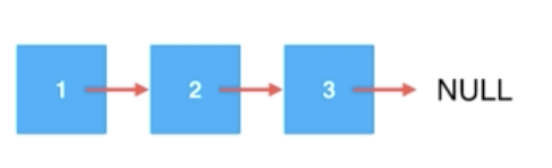
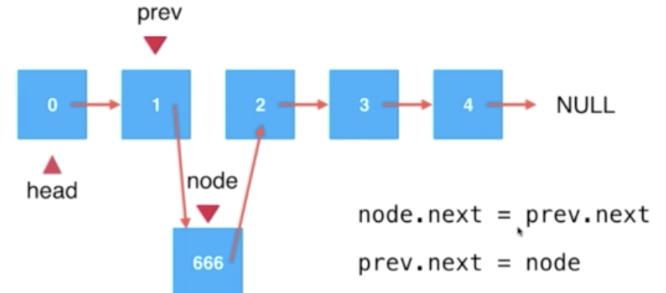
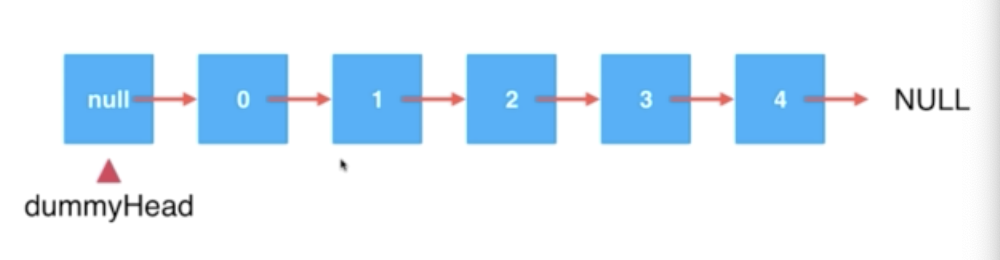
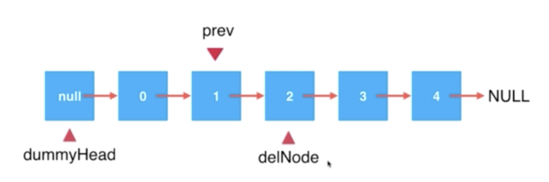
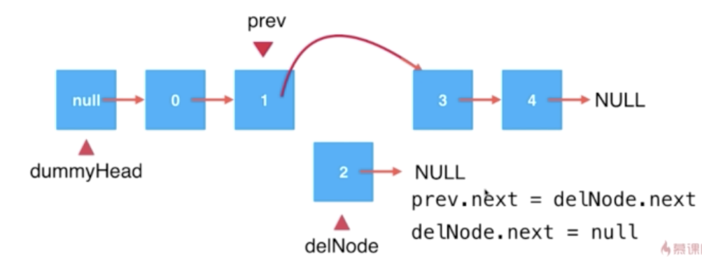
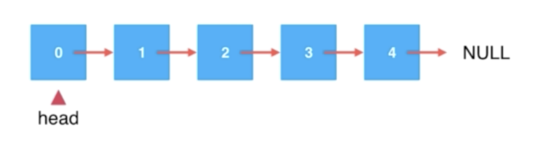
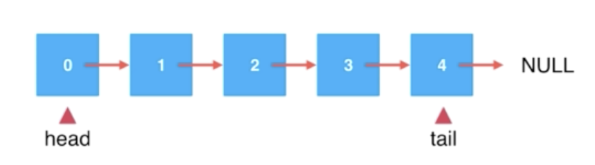

# Linked-List
> A linked list is a real dynamic data structure
- It is the most simplest dynamic data structure
- It uses reference
- It is naturally recursivable
- It assists to form other complex data structure

### Have a glance of __Node__ in Linked List
```java
class Node<E> {  // generic type E
    E e;         // Node's data of itself
    Node next;   // Node's next element, a hook
}
```
- Data is stored in the Node

- The end of Linked List is null, hence if `next == null` means it is the end of the linked list.
- Advantage: A __REAL__ dynamic data structure, we do not need to care about the fixed memory/space issue (same issue happened in Queue).
- Disadvantage: Lost the random accessing ability.
> Due to the memory for an array is continuous in stack, so we can use an index to access the element of an array. However, in __Linked List__, we can only iterate the whole list to find the element we need. 
> - so the time complexity of finding operation in Linked List is O(n).

### Have a glance of members in Linked List
- A linked list should have a __head__ pointing to the very first element of the list
- And __size__
```java
class LinkedList<E> {
    // Node can be defined as a internal class in LinkedList
    private class Node<E> {  // generic type E
        E e;         // Node's data of itself
        Node next;   // Node's next element, a hook
    }
    private Node head;
    private int size;
    
    public LinkedList(){
        this.head = null;
        this.size = 0;
    }

}
```
> In array, append element to the end of array is fast, can use size to access
> In Linked List, add element to the head is fast, no need iterate everything

### Insert an element to linked list

- iterate to the position designated for insertion, use `prev` to record the position
- assign `prev.next` to the new node's next
- assing `prev.next` with the new node
Done
> this order is important. Otherwise the insertion may failed

### Dummy Head Node
> However, when adding element before the head, then we have to handle this case separately. In this case, dummy head node will be introduced.

- This mechanism is not expose to users.
- the real __head__ is the next element of __dummyHead__
> Hence, now adding element to head of linked list is not an odd case, so that we can use `add(index, element)` to perform add to head and add to tail without special handling.

### Remove an element from linked list

> Let's say I want to delete the element whose index = 2, we will use __prev__ to find the element before the __delNode__, then point `prev.next` to node 3 directly.
>`prev.next = delNode.next` then `delNode.next = null`


### Time Complexity
- Add/Delete/Get O(n) __average__
> But if element is add to head of linked list, O(1)
> 
> Delete the head element, O(1)
>
> Get the head element, O(1) 

### Hey I want to use __LinkedList__ to implement a __Queue__
> I will call it LinkedListQueue
> 
> At the moment, we have something like this.

> But, to be honest, this structure does not support queue functionality very well due to a Queue is FIFO.
>
> Therefore, we need an additional variable to record the tail of the queue.
> 
> Now, in this queue, 
>
> add element to tail -> O(1)
>
> remove head elelment -> O(1)
>
> It is so COOL now
>
> __head is the front of the queue, tail is the last of the tail__

#### Enqueue operation
- check if `tail == null`
    - `tail = new Node` at this moment, there is no Node in the lise
    - `head = tail`
    
  else 
    - `tail.next = new Node(e)`
    - tail = tail.next
    
  `size += 1` // maintain size
 
 #### Dequeue operation
```java
public E dequeue() {
    Node retNode = head;
    head = head.next;
    retNode.next = null;
    if (head == null) { // if head is null, means there is no Node here 
        tail = null;       
    }
    size --;
    return retNode.e;
}
```