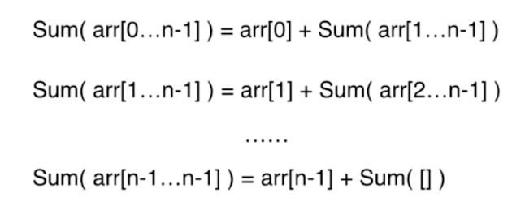
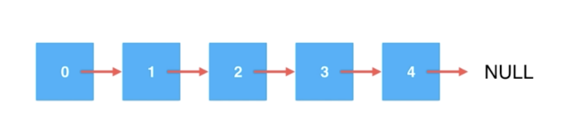
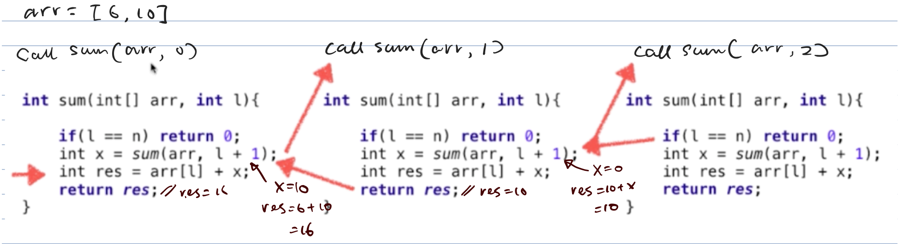
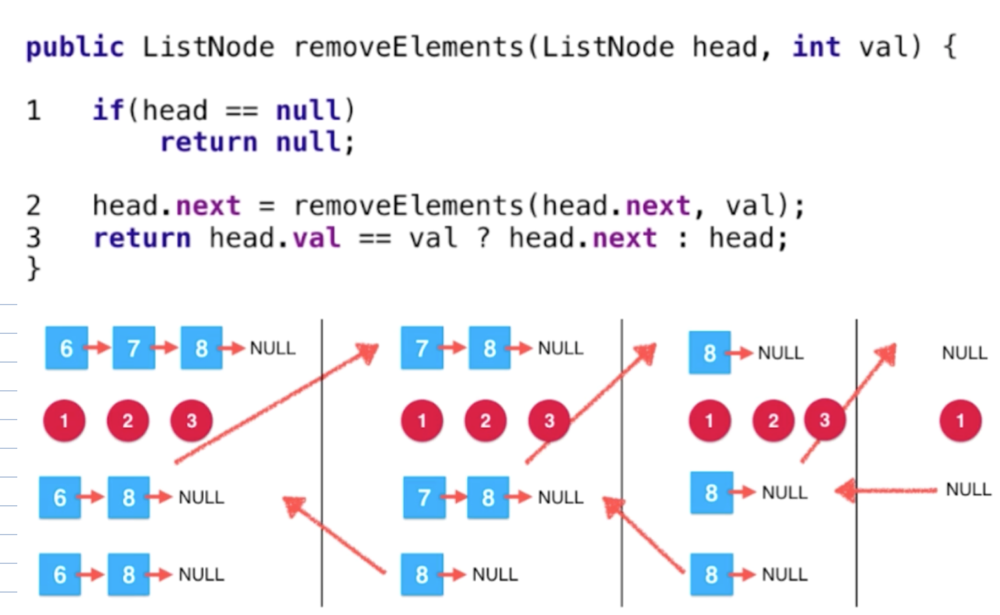
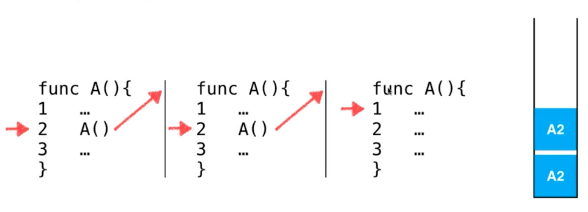

# Recursion and LinkedList
> Recursion is IMPORTANT!!

- Basically, recursion is a divide-conquer strategy.
> When the problem is very primitive, then we can solve it
> 
> For example, sum an array 
>
> `Sum(arr[0...n-1]) = arr[0] + Sum(arr[1, n-2])` a summation divid to a number + a smaller summation 
>
> 
```java
/**
 *
 * @param arr target array
 * @param l left boundary
 * @return sum of the array
 */
private static int sum(int[] arr, int l) {
    if (l == arr.length) { // the most primitive problem
        return 0;
    }
    
    // convert the original problem to a smaller problem
    return arr[l] + sum(arr, l + 1); 
}
```
> The most important part is how to divide the original problem to smaller problem

### OMG! Recursive & LinkedList
> recall: what is a linked list?
>  
> actually now we can see it like
>
> 0 -> [ Here is a shorter linked list start from 1 ] so on and so forth.
```java
    public ListNode removeElements(ListNode head, int val) {
        if (head == null) {
            return null;
        }

//      ListNode res = removeElements(head.next, val);
        head.next = removeElements(head.next, val);
//        if (head.val == val) {
//            return res;
//        } else {
//            head.next = res;
//            return head;
//        }

        return head.val == val ? head.next : head;
```

### I want to see more details of RECURSION
##### For the sum operation of array

> The recursive call is same as any other type of function call, just the function is sam as the current function
> Each time of the call based on a new set of params

#### For remove element from an LinkedList


#### Let's recall the system stack again

> recursive will consume stack memory
> recursive is good at handling  non-linear problems
