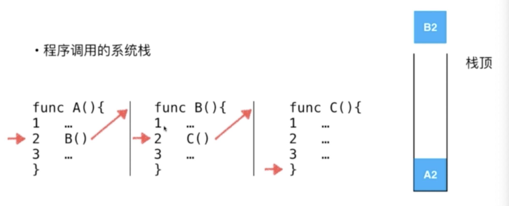

# Stack

- Stack is a LAST IN FIRST OUT type data structure
- Stack is a linear data structure
- Comparing with array, stack is a subset of array as well as the operations.
- For a stack, it can be only added a new element to one end and remove element from the same end.
- This end is call STACK TOP 

> This kind of data structure is wildly used in computer.

## Usage
- Undo operations
  - operation will be recorded in a stack, and when undo is executed, the last operation will be retrieved and __undo__.
- System stack
  - When system is invoking function B in function A, so function A will be added to stack first, then add B. 
  
  The progress of invoking are stored in the system stack.
  

## Methods
- `void push(E) // Generic type E, add new element`
- `E pop() // retrieve and remove the latest element`
- `E peek() // check the latest element`
- `int getSize() // get the stack size`
- `boolean isEmpty() // check if the stack were empty`

# Queue

- Queue is a FIRST IN FIRST OUT type data structure FIFO

## Methods
- `void enqueue(E) // Genertic type E, enter the Queue`
- `E dequeue() // retrieve the data from top of Queue`
- `E getFront() // get the top element from Queue`
- `int getSize() // get the size of current Queue`
- `boolean isEmpty() // check if the Queue were empty`
 
