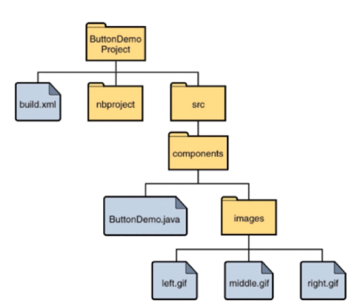
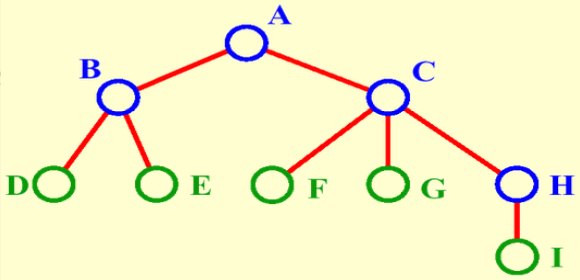
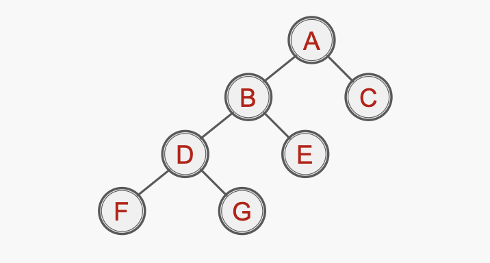
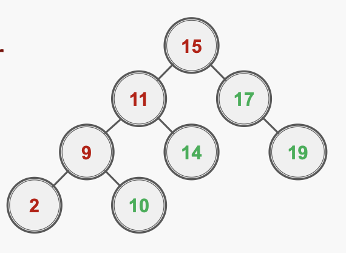
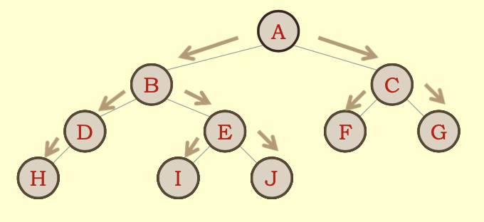
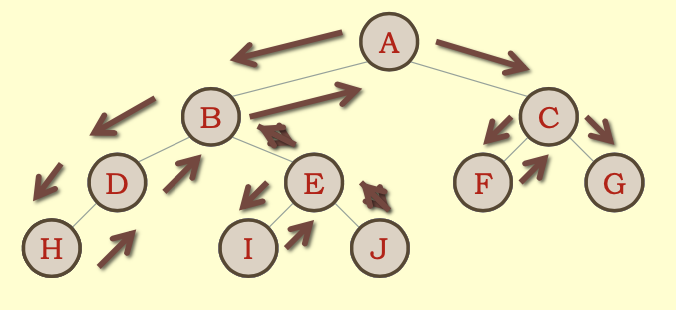
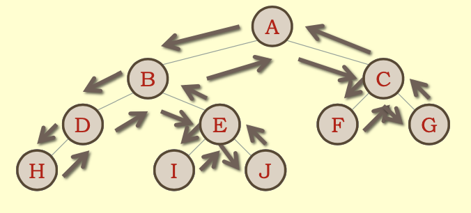

# Binary Tree
> Tree data structure is wildly used in computer science/industry.
>
> Tree is not a linear data structure

### Why Tree ?
- Tree is a natural, organized structure
> E.g: computer file system
>
> 
>
> E.g: company/organisation
>
> 
- Tree data structure is __High-Efficiency__
> Search by a tree structure is more efficient than a full iteration.

### Types of commonly used Tree data structure
- Binary search tree (BST) 二分搜索树
- Balanced binary tree 平衡二叉树
 - AVL
 - Red-Black Tree
- Heap
- Union-Find Sets
- segment tree
- Trie (字典树/前缀树)

### Binary Tree
> Have a glance of Binary Tree first.
>
> (P.S. binary tree is not exactly same as binary search tree, but most likely same lol)
>
> 
>
> - A binary tree is also a dynamic data structure, like LinkedList.
> - In a Node of binary tree, it has two reference which are pointing left and right sub nodes respectively.
>
> ```java
> class Node<E> {
>     E e;
>     Node left;
>     Node right;
> } 
> ```
> - According to this defination of binary tree, we can define __k-ary tree__ which has more than 2 sub nodes
> ```java
> class Node<E> {
>     E e;
>     Node sub1;
>     Node sub2;
>     Node sub3;
>     ... 
> } 
> ```

- A binary tree has __ONLY__ root node. In this figure, __A__ is the ONLY root of the tree
- B and C are A's left and right __child__
- Nodes without any children are called a __leaf__ or __external node__. In the figure: D, E, F, G, I are leaf nodes.
- One node in binary tree at most can have 2 children node
- One node in binary tree at most can have 1 parent node (root node has no parent)
- Hence, binary tree has natural recursive structure
    - Every node's left sub-tree is a binary tree
    - Every node's right sub-tree is a binary tree
    - BUT, a binary is not always "full"
        - Full binary tree: All __internal nodes (not leaf node)__ have exactly two children
        
        - Otherwise, the binary tree is __NOT__ full

### Binary Search Tree
> __MUST__ be a binary tree
>
> The value in each node is __greater than__ or __equal to__ all the values in its __left child__ or any of that __child's descendants__
>
> The value in each node is __less than__ or  __equal to__ all the values in its __right child__ or any of that __child's descendants__
> 
> E.g: 
>
> 
>
> E.g:
>
> 

- Optimised for searching objective.
- Values in nodes must be comparable.

##### BST Methods
- `Add(Node node, E, e)`
    
    - if node is __null__, then `root = new Node(e)`, then return
    - if `node.left == null && node.e > e` then `node.left = new Node(e)`
    - if `node.right == null && node.e < e` then `nod.right = new Node(e)`
    - Otherwise -> we will goto recursive steps
      - if `e < node.e` -> `add(node.left, e)`
      - else if `e > node.e` -> `add(node.right, e)`
    
- `PreOrderTraversal(Node root)`

    - Traverse a bst in __node-left-right__ sequece(pre-order).

    - Pre: root is the entry node of a tree or sub-tree

        > **1.** **If (root is not null)**
        >
        > 1. **Process (root)**
        > 2. **preOrder (root->leftsub-tree)**
        > 3. **preOrder (root->rightsub-tree)**
        >
        > **2.** **End if**
        >
        > **3.** **Return**
        >
        > __END PREORDER__
        >
        > 
        >
        > Result: __A B D H E I J C F G__

- `InOrderTraversal(Node root)`

    - Traverse a bst in __left-root-right__ sequence(in-order)

        > **1.** **If (root is not null)**
        >
        > 1. **inOrder (root->leftsub-tree)**
        > 2. **Process (root)**
        > 3. **inOrder (root->rightsub-tree)**
        >
        > **2.** **End if**
        >
        > **3.** **Return** **End inOrder**
        >
        > __END INORDER__
        >
        > 
        >
        > Result: __H D B I E J A F C G__

- `PostOrderTraversal(Node root)`

    - Traverse a bst in __left-right-root__ sequence(post-order)

        > **1.** **If (root is not null)**
        >
        > 1. **postOrder (root->leftsub-tree)**
        > 2. **postOrder (root->rightsub-tree)**
        > 3. **Process (root)**
        >
        > **2.** **End if**
        >
        > **3.** **Return**
        >
        > **End postOrder**
        >
        > 
        >
        > Result: __H D I E J B F C G A__

 

