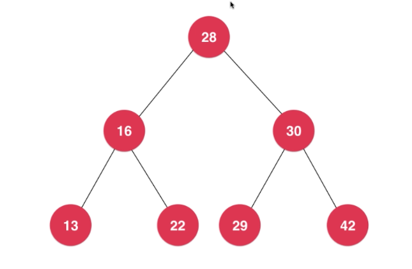
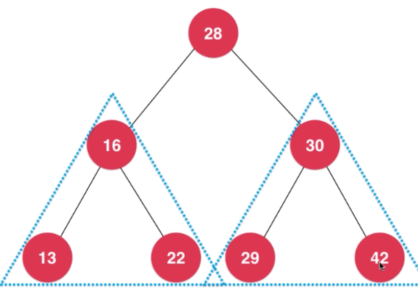

# Binary Tree
> Tree data structure is wildly used in computer science/industry.
>
> Tree is not a linear data structure

### Why Tree ?
- Tree is a natural, organized structure
> E.g: computer file system
>
> 
>
> E.g: company/organisation
>
> 
- Tree data structure is __High-Efficiency__
> Search by a tree structure is more efficient than a full iteration.

### Types of commonly used Tree data structure
- Binary search tree (BST) 二分搜索树
- Balanced binary tree 平衡二叉树
 - AVL
 - Red-Black Tree
- Heap
- Union-Find Sets
- segment tree
- Trie (字典树/前缀树)

### Binary Tree
> Have a glance of Binary Tree first.
>
> (P.S. binary tree is not exactly same as binary search tree, but most likely same lol)
>
> 
>
> - A binary tree is also a dynamic data structure, like LinkedList.
> - In a Node of binary tree, it has two reference which are pointing left and right sub nodes respectively.
>
> ```java
> class Node<E> {
>     E e;
>     Node left;
>     Node right;
> } 
> ```
> - According to this defination of binary tree, we can define __k-ary tree__ which has more than 2 sub nodes
> ```java
> class Node<E> {
>     E e;
>     Node sub1;
>     Node sub2;
>     Node sub3;
>     ... 
> } 
> ```

- A binary tree has __ONLY__ root node. In this figure, __A__ is the ONLY root of the tree
- B and C are A's left and right __child__
- Nodes without any children are called a __leaf__ or __external node__. In the figure: D, E, F, G, I are leaf nodes.
- One node in binary tree at most can have 2 children node
- One node in binary tree at most can have 1 parent node (root node has no parent)
- Hence, binary tree has natural recursive structure
    - Every node's left sub-tree is a binary tree
    - Every node's right sub-tree is a binary tree
    - BUT, a binary is not always "full"
        - Full binary tree: All __internal nodes (not leaf node)__ have exactly two children
        
        - Otherwise, the binary tree is __NOT__ full

### Binary Search Tree
> __MUST__ be a binary tree
>
> The value in each node is __greater than__ or __equal to__ all the values in its __left child__ or any of that __child's descendants__
>
> The value in each node is __less than__ or  __equal to__ all the values in its __right child__ or any of that __child's descendants__
> 
> E.g: 
>
> 
>
> E.g:
>
> 

- Optimised for searching objective.
- Values in nodes must be comparable.

##### BST Methods
- `Add(Node node, E, e)`
    
    - if node is __null__, then `root = new Node(e)`, then return
    - if `node.left == null && node.e > e` then `node.left = new Node(e)`
    - if `node.right == null && node.e < e` then `nod.right = new Node(e)`
    - Otherwise -> we will goto recursive steps
      - if `e < node.e` -> `add(node.left, e)`
      - else if `e > node.e` -> `add(node.right, e)`
    
- `PreOrderTraversal(Node root)`

    - Traverse a bst in __node-left-right__ sequece(pre-order).

    - Pre: root is the entry node of a tree or sub-tree

        > **1.** **If (root is not null)**
        >
        > 1. **Process (root)**
        > 2. **preOrder (root->leftsub-tree)**
        > 3. **preOrder (root->rightsub-tree)**
        >
        > **2.** **End if**
        >
        > **3.** **Return**
        >
        > __END PREORDER__
        >
        > 
        >
        > Result: __A B D H E I J C F G__

- `InOrderTraversal(Node root)`

    - Traverse a bst in __left-root-right__ sequence(in-order)

        > **1.** **If (root is not null)**
        >
        > 1. **inOrder (root->leftsub-tree)**
        > 2. **Process (root)**
        > 3. **inOrder (root->rightsub-tree)**
        >
        > **2.** **End if**
        >
        > **3.** **Return** **End inOrder**
        >
        > __END INORDER__
        >
        > 
        >
        > Result: __H D B I E J A F C G__

- `PostOrderTraversal(Node root)`

    - Traverse a bst in __left-right-root__ sequence(post-order)

        > **1.** **If (root is not null)**
        >
        > 1. **postOrder (root->leftsub-tree)**
        > 2. **postOrder (root->rightsub-tree)**
        > 3. **Process (root)**
        >
        > **2.** **End if**
        >
        > **3.** **Return**
        >
        > **End postOrder**
        >
        > 
        >
        > Result: __H D I E J B F C G A__

    - Post-order traversal can be used to release the memory of the bst.

- Other type of traversal

    > There are also __level order traversal__ of a binary tree. In accordance with the former figure, the traversal result will be: A B C D E F G H I J

### Find the biggest / smallest value of BST

- Biggest: the most left node
- Smallest: the most right node

### Remove the biggest / smallest Node 

- From last point, we know the extreme values are same the most left / right values.

- When removing the node, there are different senarios.

  - if the node is a __leaf node__, just simply break the connection, it will be removed.

  - if the node is __not__ a leaf node, there are problems.

    

    - Node 22 is going to be removed, so the right sub tree will replace the postion of 22, therefore, Node 33 will become the left child of Node 41

    ```java
        public E minimum() {
            if (this.size == 0) {
                throw new IllegalArgumentException("Fail to run minimum(), empty bst");
            }
    
            return minimum(this.root).e;
        }
    
        private Node minimum(Node node) {
            if (node.left == null) {
                return node;
            }
    
            return minimum(node.left);
        }
    
        public E maximum() {
            return maximum(this.root).e;
        }
    
        private Node maximum(Node node) {
            if (node == null) {
                return null;
            }
    
            if (node.right == null) {
                return node;
            }
    
            return maximum(node.right);
        }
    
        public E removeMin() {
            E min = minimum();
    
            removeMin(this.root);
    
            return min;
        }
    
        private Node removeMin(Node node) {
            if (node.left == null) {
                Node right = node.right;
                node.right = null;
                this.size--;
                return right;
            }
    
            node.left = removeMin(node.left);
            return node;
        }
    
        public E removeMax() {
            E max = maximum();
    
            removeMax(this.root);
    
            return max;
        }
    
        private Node removeMax(Node node) {
            if (node.right == null) {
                Node left = node.left;
                node.left = null;
                this.size--;
                return left;
            }
    
            node.right = removeMax(node.right);
            return node;
        }
    ```


### Remove a random node of BST

> We have knowledge of removing the biggest / smallest node in BST, so now removing a random node is easier for us.

Here we can dismentle the removing job to few different tasks.

- Remove a node with __ONLY__ left / right child.

  - ONLY have left child -> use its left child to replace the node

  - ONLY have right child -> user its right child to replace the node

    > This is similar with removing biggest / smallest value of BST

- Remove a node with __BOTH__ left & right child, A.K.A. Hibbard Deletion

  

  Let's say we are going to delete node 58.

  Node 58 is removed, so now we need find another node to replace node 58. We are going to use next node greater than 58 to replace it.

  It is the smaller node of node 58's right child.

  In this case, it will be node 59

  

  - remove node 59 from node 58 right child

  - AND point node 41 right child to node 59

  - point node 59 right child to node 60

  - point node 59 left child to node 58 left child

    

  - Here we go

    