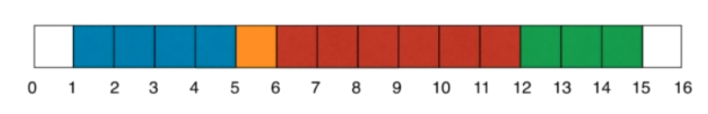
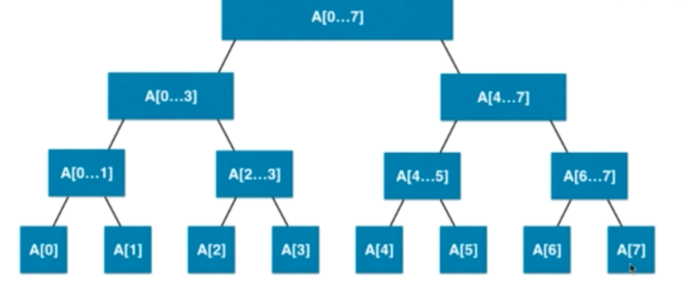

# Segment Tree
> Let's image a senario.
>
> There is a wall with length N, every time you will choose a segment of the wall and paint it. Overlapping is possible.
>
> After M times painting, how many colors we will see on the wall
>
> After M times painting, how many colors we will see on the wall in range [i, j] 
>
> 

There will be 2 types of operation.

- paiting() -> update the range -> segment tree O(logN)
- query() -> query the result -> segment tree O(logN)

### Segment Query

> Let's say, you only want to query the color in between [i, j], or even not color array, you want to query an array of instance.
>
> Within [i, j], you need the max/min/sum of the instances
> 
>
> However, the leaf node of segment tree is not always at the same level
>
> 
>
> Therefore, segment tree is not a complete / nearly complete binary tree.
>
> BUT, segment tree is a balance binary tree.

